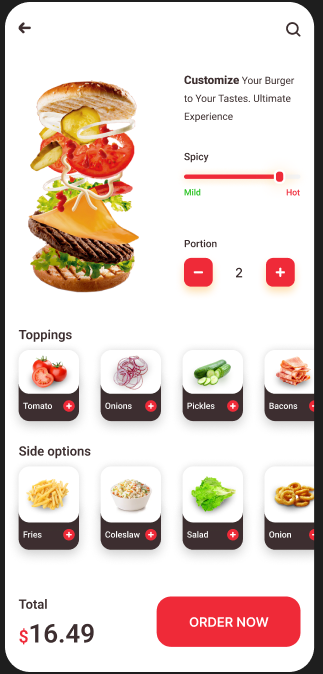

# MediunOrder - Kotlin Multiplatform Food Ordering App

A modern food ordering application built with Kotlin Multiplatform (KMP) and Compose Multiplatform, allowing users to customize and order burgers with a beautiful, interactive interface.

## FigmaInput

https://www.figma.com/design/CP80TPBxJhPIYZe7wrVKu6/Medium_Order?node-id=0-1



## 🍔 Features

- **Cross-platform**: Runs on both Android and iOS with shared codebase
- **Interactive Burger Customization**: 
  - Spice level slider (Mild to Hot)
  - Portion selection with +/- controls
  - Multiple topping options (Tomato, Onions, Pickles, Bacon, Cheese, Mushroom)
  - Side dish selection (Fries, Coleslaw, Salad, Mozzarella)
- **Modern UI**: Material Design 3 with custom styling and animations
- **Responsive Design**: Adapts to different screen sizes and orientations

## 🏗️ Architecture

### Project Structure

```
Figma_MCP_MediunOrder/
├── composeApp/                    # Shared Compose Multiplatform code
│   ├── src/
│   │   ├── commonMain/           # Shared code for all platforms
│   │   │   ├── kotlin/          # Main app logic and UI components
│   │   │   └── composeResources/ # Shared images and resources
│   │   ├── androidMain/         # Android-specific code
│   │   └── iosMain/             # iOS-specific code
├── iosApp/                       # iOS application wrapper
└── gradle/                       # Build configuration
```

### Technology Stack

- **Kotlin Multiplatform**: Cross-platform development framework
- **Compose Multiplatform**: Shared UI framework for Android and iOS
- **Material Design 3**: Modern design system
- **Gradle**: Build system with version catalogs
- **SwiftUI**: iOS app wrapper

## 🚀 Getting Started

### Prerequisites

- **Android Development**:
  - Android Studio Hedgehog or later
  - Android SDK (API level 24+)
  - JDK 11 or later

- **iOS Development**:
  - Xcode 15.0 or later
  - macOS 13.0 or later
  - iOS 13.0+ deployment target

### Installation

1. **Clone the repository**:
   ```bash
   git clone <repository-url>
   cd Figma_MCP_MediunOrder
   ```

2. **Open in Android Studio**:
   - Open the project in Android Studio
   - Sync Gradle files
   - Wait for dependencies to download

3. **Run on Android**:
   - Select an Android device or emulator
   - Click the "Run" button or use `./gradlew :composeApp:assembleDebug`

4. **Run on iOS**:
   - Open `iosApp/iosApp.xcodeproj` in Xcode
   - Select an iOS simulator or device
   - Build and run the project

### Build Commands

```bash
# Build for Android
./gradlew :composeApp:assembleDebug

# Build for iOS
./gradlew :composeApp:linkReleaseFrameworkIosArm64

# Clean build
./gradlew clean
```

## 📱 App Screenshots

The app features a single main screen with:

- **Hero Image**: Large burger image with customization options
- **Spice Control**: Interactive slider for spice level selection
- **Portion Control**: Plus/minus buttons for quantity selection
- **Toppings Section**: Scrollable horizontal list of available toppings
- **Side Options**: Additional side dish selections
- **Order Summary**: Total price and "ORDER NOW" button

## 🎨 UI Components

### Main Components

- `ProductScreen`: Main screen containing all UI elements
- `ToppingsRow`: Reusable component for topping/side selection
- Custom icons and images for food items and controls

### Design System

- **Colors**: Custom color palette with primary red (#EF2A39) and dark brown (#3C2F2F)
- **Typography**: Material Design 3 typography with custom font weights
- **Spacing**: Consistent 8dp grid system
- **Shapes**: Rounded corners (10dp, 15dp, 20dp) for modern look

## 🔧 Configuration

### Version Management

The project uses Gradle Version Catalogs (`gradle/libs.versions.toml`) for dependency management:

- **Kotlin**: 2.1.0
- **Compose Multiplatform**: 1.8.0
- **Android Gradle Plugin**: 8.12.0
- **Android SDK**: API 35 (Android 15)

### Platform Targets

- **Android**: API 24+ (Android 7.0+)
- **iOS**: iOS 13.0+
- **Architectures**: 
  - Android: ARM64, x86_64
  - iOS: ARM64, x86_64, Simulator ARM64

## 🧪 Testing

The project includes basic test structure:

```bash
# Run Android tests
./gradlew :composeApp:testDebugUnitTest

# Run iOS tests (currently disabled due to configuration)
# ./gradlew :composeApp:iosX64Test
```

## 📦 Dependencies

### Core Dependencies

- **Compose Multiplatform**: UI framework
- **Material Design 3**: Design system
- **AndroidX Lifecycle**: Lifecycle management
- **Kotlin Test**: Testing framework

### Platform-Specific

- **Android**: Activity Compose, Preview support
- **iOS**: SwiftUI integration, UIKit bridge

## 🤝 Contributing

1. Fork the repository
2. Create a feature branch (`git checkout -b feature/amazing-feature`)
3. Commit your changes (`git commit -m 'Add amazing feature'`)
4. Push to the branch (`git push origin feature/amazing-feature`)
5. Open a Pull Request

## 📄 License

This project is licensed under the MIT License - see the LICENSE file for details.

## 🔗 Resources

- [Kotlin Multiplatform Documentation](https://kotlinlang.org/docs/multiplatform.html)
- [Compose Multiplatform Documentation](https://www.jetbrains.com/lp/compose-multiplatform/)
- [Material Design 3](https://m3.material.io/)
- [Android Studio](https://developer.android.com/studio)
- [Xcode](https://developer.apple.com/xcode/)

## 🐛 Known Issues

- iOS tests are currently disabled due to configuration issues
- SVG conversion is disabled as icons are already in XML format

---

**Built with ❤️ using Kotlin Multiplatform and Compose Multiplatform**